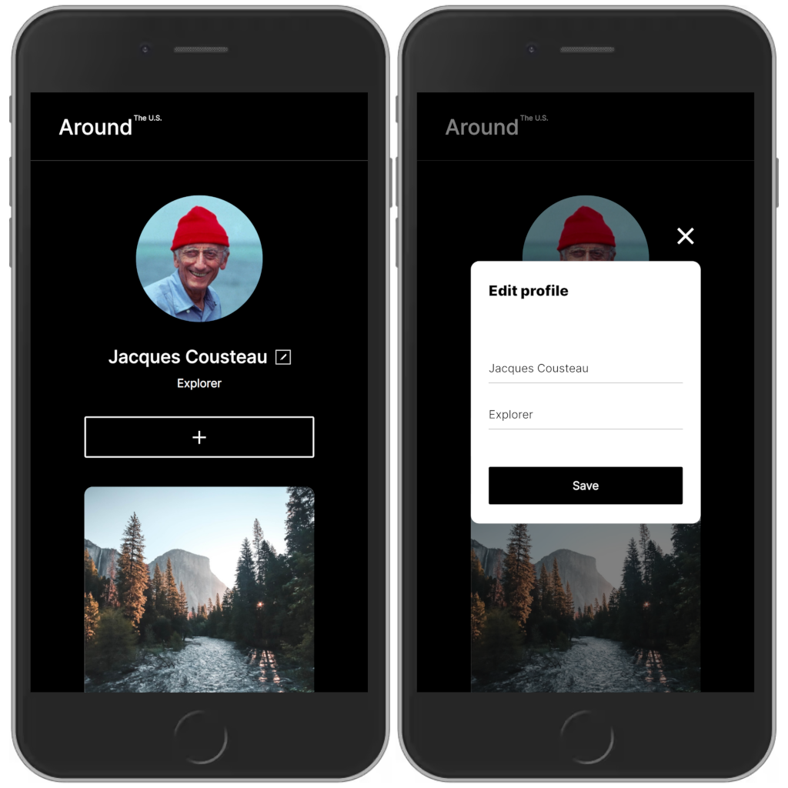
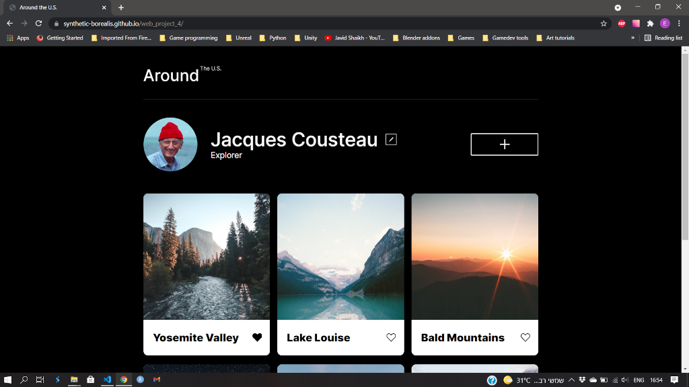

# Project 5: Around The U.S.

[Click here to visit](https://synthetic-borealis.github.io/web_project_4/)

## Description
A one page website for travellers. The website is responsive and should display well on different devices and resolutions (including PCs, tablets & mobile phones).

The website was created in HTML5, CSS & JavaScript.

## Possible Improvements
- Validate image links when new place cards are created.

## Showcase
<figure>
  
  <figcaption>Fig. 1: The website running inside Chrome's device emulator.</figcaption>
</figure>

 

<figure>
  
  <figcaption>Fig. 2: The website running normally inside Chrome.</figcaption>
</figure>
