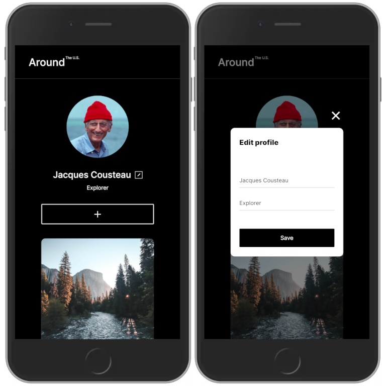
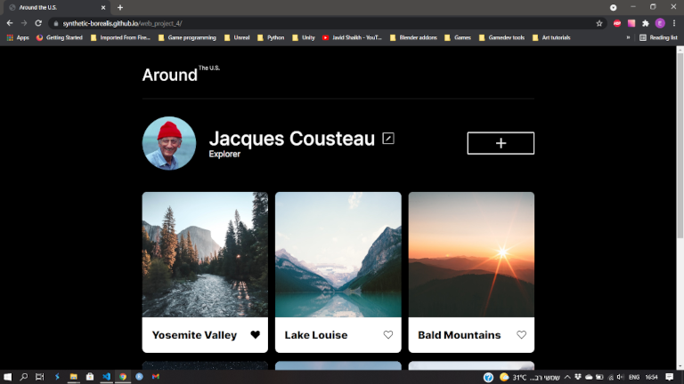

# Project 9: Around The U.S.

## Description
A one page website for travellers. The website is responsive and should display well on different devices and resolutions (including PCs, tablets & mobile phones).

The website was created in HTML5, CSS & JavaScript, and bundled with WebPack.

Click [here](https://synthetic-borealis.github.io/web_project_4/) an unbundled version of the site.

## Possible Improvements
- Ensure url inputs don't accept non-https (or http) as valid input (perhaps with the pattern attribute).
- Optional: Ensure links point to valid image files when creating image cards (will probably require use of AJAX).

## Showcase
<figure>
  
  <figcaption>Fig. 1: The website running inside Chrome's device emulator.</figcaption>
</figure>

 

<figure>
  
  <figcaption>Fig. 2: The website running normally inside Chrome.</figcaption>
</figure>
